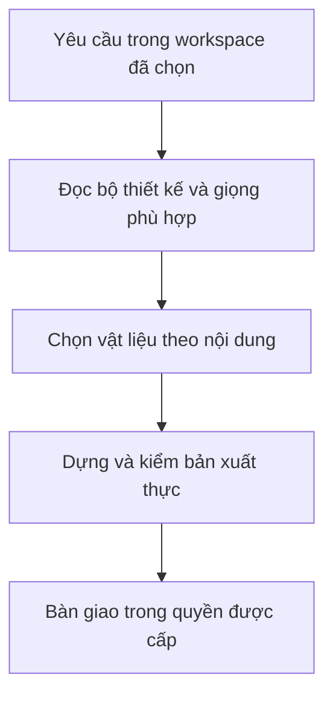

# Quy trình sử dụng

```mermaid
flowchart TD
A[Yêu cầu trong workspace đã chọn] --> B[Đọc bộ thiết kế và giọng phù hợp]
B --> C[Chọn vật liệu theo nội dung]
C --> D[Dựng và kiểm bản xuất thực]
D --> E[Bàn giao trong quyền được cấp]
```
