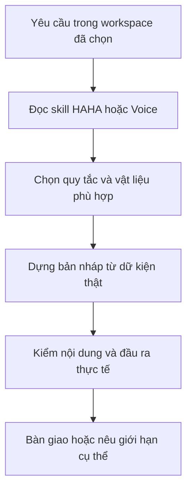

# Quy trình sử dụng

```mermaid
flowchart TD
A[Yêu cầu trong workspace đã chọn] --> B[Đọc skill HAHA hoặc Voice]
B --> C[Chọn quy tắc và vật liệu phù hợp]
C --> D[Dựng bản nháp từ dữ kiện thật]
D --> E[Kiểm nội dung và đầu ra thực tế]
E --> F[Bàn giao hoặc nêu giới hạn cụ thể]
```
